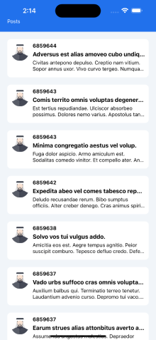

This is a sample React Native application built using TypeScript and React Navigation. It consists of three screens: Splash, Posts, and Post Details. The application fetches posts data from an API and displays it on the Posts screen. When a user taps on a post, they are navigated to the Post Details screen where they can view more details about the selected post.

**Features**

.Splash screen displayed when the app is launched.

.Posts screen displaying a list of posts fetched from an API.

.Post Details screen showing detailed information about a selected post.

**Prerequisites**

Before running the application, make sure you have the following installed:

.Node.js

.npm or Yarn

.React Native CLI

.Android Studio / Xcode for emulator or a physical device for testing

**Getting Started**

1. Clone the Repository:
   git clone https://github.com/MahmoudIbrahim1989/Breadfast-Task.git

2. Install Dependencies:
   npm install
3. Run the Application:

   .For iOS:

   npx react-native run-ios

   .yarn android

   npx react-native run-android

**Project Structure**

Breadfast-Task/

│ ├── assets/

│ │── images

│ │── components/

│ │── header.tsx

│ │── models.tsx

│ │── posts.tsx

│ │── types.tsx

│ │── screens/

│ │── splashScreen.tsx

│ │──homeScreen.tsx

│ │── postDetailsScreen.tsx

│── App.tsx

│── package.json

│── README.md

**Libraries Used**

1. React Navigation: For navigation within the app.
2. axios: For making HTTP requests to fetch posts data.

**screenshots**

